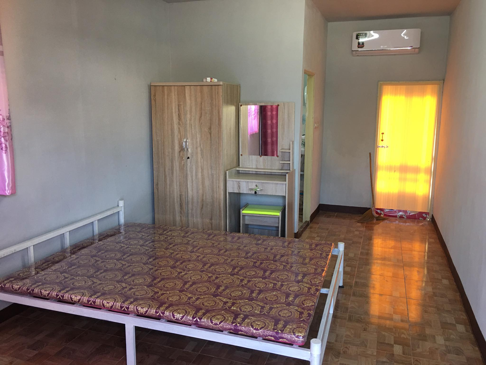

# วันศุกร์ ที่ 20 พฤศจิกายน 2563

## การเดินทาง
ก่อนจะเริ่มเดินทาง ต้องทำเรื่องลงทะเบียนเรียนกับเรื่อง กรอ ให้เรียบร้อยก่อน เวลา 09:00 น.เตรียมเอกสารให้เรียบร้อยแล้วไปส่งที่มหาวิทยาลัย ถึงกลับมาเตรียมของที่จะเดินทางไปที่ อำเภอกุมภวาปี จังหวัดอุดรธานี การเดินทาง เลือกใช้รถจักยานยนต์ของตนเอง ของที่จะใช้จึงไม่เยอะมาก มีเสื้อผ้าที่เป็นชุดนักศึกษา เสื้อช็อป และเสื้อใส่ออกกำลังกาย(เผื่อมีเวลาได้ออกกำลังกาย) อุปกรณ์ในการทำงาน จะเป็น Macbook IPad IPhone และของใช้ส่วนตัว

เริ่มออกเดินทางเวลา 10:05 น. เติมน้ำมันให้เต็มถัง มัดของให้แน่นๆ เปิดGPS ปลายทางคือ กุมภวาปีรีสอร์ท รถทำความเร็วเฉลี่ย 70-75 กิโลเมตร/ชั่วโมง
ถึงที่พักเวลา 12.10 น. หลังจากได้นอนพักไปสองชั่วโมง เริ่มขับรถหอที่พักในตัวอำเภอ ขับรถวนหาที่พัก โดยเน้นให้ใกล้กับที่จะมาฝึกงาน และราคาไม่สูงเกินไป จนได้ที่พัก ราคา2500 บาท น้ำหน่วยละ 20 บาท ไฟหน่วยละ 10บาท หน้าโรงเรียนกุมภวาปี
จ่ายค่าห้องรวมค่ามัดจำ ก็ 4200บาท หมดตัวพอดี เหลือเงินสด นิดหน่อย พอได้ ซื้อ ข้าวในตลาดไปกินอยู่รีสอร์ท

###   ค่าใช้จ่ายทั้งหมด
* น้ำมันรถ 110 บาท
* ที่พักเดินแรกรวมค่ามัดจำ 4200 บาท
* รีสอร์ท 500 บาท
* ค่าอาหารประมาณ 100 บาท

# วันเสาร์ ที่ 21 พฤศจิกายน 2563

## เข้าหอพัก
ออกจากรีสอร์ท เวลา 11.00 น. เดินทางมาที่พัก 10นาที เช็คหน่วยไฟ เช็คหน่วยน้ำก่อนที่จะเริ่มใช้ จัดของ แล้วออกไฟซื้อของที่ยังต้องใช้ พอดีเมื่อคืน แม่ส่งเงินให้มา4000 บาท เลยได้ซื้อของใช้เข้าห้องได้บ้าง หาซื้อจนถึงบ่ายสาม แล้วก็เดินทางไปบ้านพี่เบน ได้ฟังคำแนะนำและทำความรู้จักเพิ่ม อยู่จนถึงสองทุ่มก่อนที่จะเริ่มงานวันจันทร์ เลยได้เรียนรู้ทางด้านโปรแกรมที่จะใช้งาน และ เครื่องมือที่จะใช้พัฒนา และได้การบ้านให้กลับไปเตรียมตัว
###   ค่าใช้จ่ายทั้งหมด
- ของใช้
  - โต๊ะรีดผ้า 169 บาท
  - ราวตากผ้า 199 บาท
  - ผ้าห่ม 299 บาท
  - โคมไฟ 199 บาท
  - ของเบ็ดเตล็ด 500 บาท
- อาหาร1วัน ประมาณ 250 บาท
